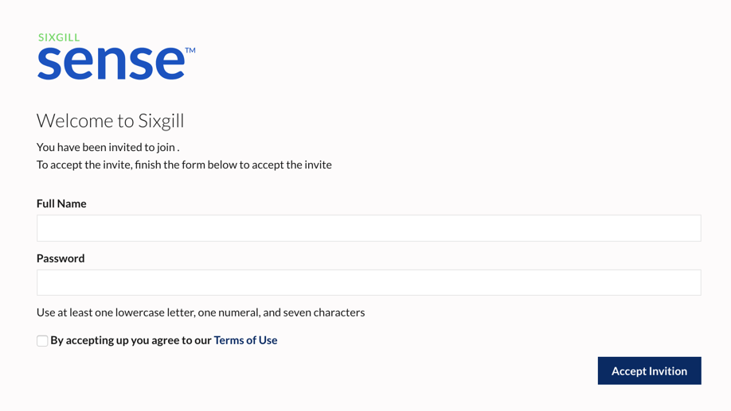
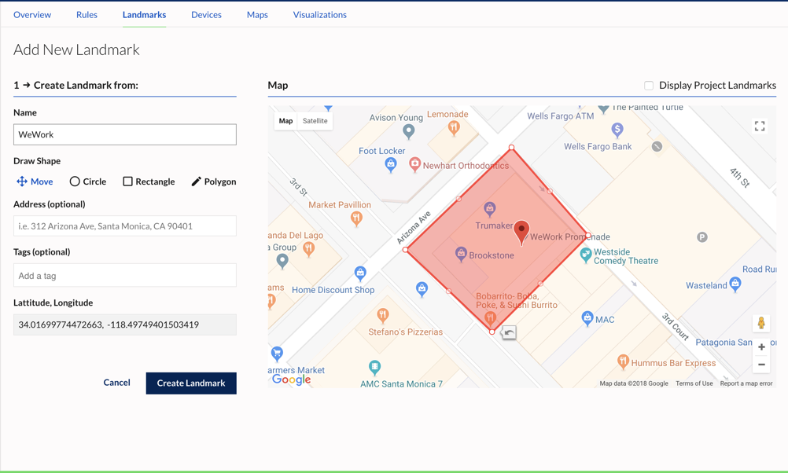

Getting Started with Sense
==========================================

*A guide for on-boarding users and devices onto the Sense platform*

*   [Create a Sixgill Sense account](#creating-an-account)
    *   [Joining an Existing Organization](#joining-an-existing-organization)
*   [Creating a Channel](#creating-a-channel)
    *    [API Keys](#api-keys)
*   [Configuring a Channel for Push](#configuring-a-channel-for-push)
    *   [Apple Push](#apple-push)
    *   [Android Push](#android-push)
*   [Connecting Devices](#connecting-devices)
    *   [iOS](#ios)
    *   [Android](#android)
    *   [IoT Devices](#iot-devices)
*   [Creating a Rule](#creating-a-rule)
    *   [Adding a Landmark](#-adding-a-landmark-condition)
    *   [Adding an Attribute](#adding-an-attribute-condition)
    *   [Adding an Action](#adding-an-action)
    *   [Adding Rule Details](#adding-rule-details)
    *   [Activating the Rule](#activating-the-rule)
*  [Creating a Landmark](#creating-a-landmark)
*   [Using the Sense API](#using-the-sense-api)

## Creating an Account
----------------------------------

You will need an account to get started with Sixgill Sense. You can sign up one of two ways: you will either create your organization OR you will be invited to an existing one. If you are creating own organization, follow these steps. If you are joining an organization created by someone else, skip to [Joining an Existing Organization](#joining-an-existing-organization)

1.  Go to [sense-dashboard.sixgill.com](http://sense-dashboard.sixgill.com) and sign up for an account. You will be required to validate your email address.
    
2.  Once you are signed in, you can add other users to your organization through the Admin tab.

### Joining an Existing Organization

Once you have been invited to join an existing organization, you will receive an email invitation titled "Welcome to Sixgill Sense".

1. In the email, click "Accept Invite".
2. Enter your full name and desired password. Read and accept the terms of service.
3. Click "Accept Inviation" to sign in to the organization's dashboard.

## Creating a Channel
A data Channel is a source of data that flows into the Sense platform. For example, a Channel could include all iOS devices with an app that uses the Sense Reach iOS SDK. Channels are collections of mobile apps that use the Sense SDKs, or of any other devices that write to the Sense Ingress API.

1.  In the dashboard, go to Channels. If this is your organization's first channel, you will be presented with an Intro screen. Click **Add New Channel**
2.  Click on the type of channel you would like to create
    -  Select **iOS Mobile Devices** to create a channel for iOS data for apps using the Sense Reach iOS SDK
    -  Select **Android Mobile Devices** to create a channel for Android data for apps using the Sense Reach Android SDK
    -  Select **IoT Devices** to create a channel for generic IoT data that will be sent using the Sense Ingress API
3.  Enter a name for your channel. Channel names must be unique to your account.

This will create a Channel for the type of data you wish to ingest.

## API Keys
To send sensor data to the platform using the Ingress API or the mobile SDKs, you will need to authenticate using an API key for the respective channel - eg, iOS devices use an iOS channel, IoT devices use an IoT channel, etc. You can get these keys from the **Channels** page on the dashboard.

1. In the dashboard, go to Channels
2. Click the appropriate channel on the left, or create a new channel.
3. Copy an existing key from **Api Keys** section, or click **Generate New ApiKey** to create another for the same channel.

## Configuring a Channel for Push
In order to receive Push notifications, the Channel will need to be configured with mobile keys depending on the app you are using to stream data. For iOS, you will need to upload the Push certificate for your app as a **.p12 file**. For Android, you will need the Firebase key or Google Cloud Messaging key used by the app.

1. Go to Channels
2. Select the mobile channel you wish to add mobile keys for.
3. Click **Manage Mobile Keys** at the top right corner  

### Apple Push ###
- If this is an iOS channel, select the type of Environment this certificate is configured for - **Development** or **Production**. This needs to match the certificate type for Push to work so double-check that you have selected the correct option.
- Click "Choose File" and select the .p12 file from your system.
- Click **Save**  
The certificate type should be listed on the left.

### Android Push ###
- If this is an Android channel, select the messaging type you will be using - **Google Cloud Messaging** or **Firebase Cloud Messaging**. This needs to match the messaging type used by the app, so double-check that you have selected the correct option.
- Enter the API key
- Click **Save**  
The selected messaging type should be listed on the left.

_Note: If you are using the Sync 2.0 demo app and would like to test the Send Push action, please contact support@sixgill.com to configure your Channel with the proper push certificate_  

## Connecting Devices
Device sensor data is ingested into Sense 2.0 through the [Ingress API](http://docs.sixgill.com/ingress-api.html). For Android and iOS devices, this can be done by integrating the Sense SDK into a mobile app. The SDK handles sensor gathering at configurable intervals, and automatically sends the data to the Ingress API. **The SDKs are authenticated using the API keys for their respective channels.**

### iOS

[Sixgill Reach iOS SDK and User Guide](http://docs.sixgill.com/ios-sdk-objc-docs/user-guide.html)
*updated July 19th, 2018*

### Android

[Sixgill Reach Android SDK and User Guide](http://docs.sixgill.com/android-user-guide.html)
*updated July 19th, 2018*
  
### Sixgill Sync 2.0
Users can also demo the mobile SDK capabilities by using the Sixgill Sync 2.0 demo application, available on the App Store and (coming soon) the Google Play Store.

[Sixgill Sync 2.0 for iOS](https://itunes.apple.com/us/app/sixgill-sync-2-0/id1272269863?mt=8)

Sixgill Sync 2.0 for Android (coming soon)

1.  Download the app on your device using the link above
2.  Login with your Sense 2.0 account credentials. iOS devices should select an **iOS Mobile Devices** Channel and Android devices should use an **Android Mobile Device** Channel

_Note: The ability to scan QR codes has been temporarily removed from the Sync app._  

If using Sense 2.0 account credentials, you will be asked to select your project and channel.

3. Your device will now connect to your selected Channel. The app will begin collection sensor data events for ingestion by the Sense platform.

You will know that Sync is connected by checking your Log Information pane. The Data section should be populated with your device data.
  

### IoT Devices

The platform is able to ingest generic IoT sensor data. Developers will need to use the [Ingress API](http://docs.sixgill.com/ingress-api.html) to send data to the IoT events endpoint.

1.  [Schemas](#schemas) may be required depending on the format of your sensor data. Contact [support@sixgill.com](mailto:support@sixgill.com) with any questions regarding setting up your channel for IoT data.
2. Create an **IoT Devices** Channel if you do not have one already and select the Schema you created.
3.  Use the Channel API keys to register your IoT device. Use the JSON Web Token in the response to authenticate your future requests.
4.  You can begin sending sensor data to the IoT events endpoint using a [gateway](http://docs.sixgill.com/gateway-ingress-api.html) or other agent.  

See the IoT Events section of the [Ingress API](http://docs.sixgill.com/ingress-api.html) docs for more information.
  
#### Schemas

Device data needs to be mapped to fields so you can trigger rules and view analytics. This is done using Schemas. Mobile devices (iOS, Android) have predefined schemas that you can use with our SDK and you don’t need to configure them.  

For IoT devices you need to first create a custom schema. You can send any kind of data with IoT devices. It is recommended that you generate IoT schema based on your event payload. Once your schema is defined you can use it in a Channel and see data being ingested. You can update a schema if necessary at a later time.

## Creating a Rule
Rules are at the heart of device interactivity within the Sense platform. Rules define conditions around devices and sensor data and specify the actions to trigger when the conditions are met. For example, devices entering a geofence or coming within range of a beacon could trigger a notification to another device, send an email to a recipient, or post data to another web service. Rules can be complex and perform multiple actions or include data from multiple channels.

1. In the dashboard, go to Projects > Rules
2. Click **Add New Rule**
3. Enter the condition(s) for the rule. You can choose from a *Landmark Condition* or *Attribute Condition*

### Adding a Landmark Condition  

Landmark - A landmark is a geofence around a certain location. It can be a circle, polygon, or rectable.

**When will the event happen?**   
First select WHEN the event will trigger in relation to the landmark.  
a) Inside Area - Trigger when device is inside this landmark
b) Exit Area - Trigger when the device was previously inside this landmark, and then leaves it   
c) Enter Area - Trigger when the device was previously outside this landmark, and then enters it    
d) Outside Area - Trigger when the device is outside this landmark  

**Which location do you want the event to trigger from?**  
Next, select the landmark for this condition
- To use an existing landmark from the project, click **Select From Project Landmarks**. This will display a list of available landmarks, if any. Clicking on the name will display the landmark in the map. You can use the **Search By Landmark Name** search box to filter the list.
- To create a new landmark, click **Add New Landmark**

  

a) Move the map or use Google Addresses to center the map as needed, or select from Existing Landmarks  
b) Use the Drawing Tools to create a geofence around your desired area  
c) Click **Use Geofence**  
d) Enter a name for the landmark  
e) Click **Create Landmark** to save  

For testing purposes, we recommend adding a landmark around your current geographical area.  

Landmarks for the project can also be created separately in the **Landmarks** section. You can then select these landmarks when creating a rule under **Select From Project Landmarks**.

### Adding an Attribute Condition
Attribute - a custom condition or freeform condition which allows you to specify attributes/properties and the logical condition(s) to be evaluated. These conditions can be simple using pre-defined attributes (Manufacturer, Device Type) or written to be more complex using the Advanced editor. The attributes being compared in the conditions will need to exist in the data stream for the device.

4. When adding conditions, be sure to select whether these are **AND or OR** conditions.  
**AND** is selected by default, meaning the device will need to satisfy all conditions to trigger the rule. For example, a device needs to be inside a landmark AND also be an iOS device to trigger the rule.  
**OR** can be used if the device only needs to satisfy one condition to trigger the rule. For example, a device needs to either be inside a landmark OR be an iOS device to trigger the rule.
 
### Adding an Action
An action is the behavior that is executed when the conditions are met. An action can be in the form of sending an SMS, a Push message, an email, a webhook, or a combination of actions.  
a) Click *New Action* under the Actions section
b) Select your desired action by clicking on the action: SMS, Email, Send Push, Webhook   

#### SMS  
- **Message** - Enter the SMS message to be sent to recipients   
- **Phone Numbers** - Enter the recipient phone numbers, numerals only. Hit "Enter" after each number.

#### Email  
- **Subject** - Enter the subject line of the email   
- **Message** - Enter the desired message body  
- **Recipients** - Enter the recipient email addresses. Hit "Enter" after each address.   

#### Send Push  
- **Subject** - Enter the subject line of the message  
- **Message** - Enter the desired message body  
- **Recipients** - Check the **Triggering Device** box (most commonly used). You could also specify a list of device IDs. Hit "Enter" after each device ID.   

#### Webhook  
- **URL** - Enter the URL to send the webhook action to.  
- **Method** - Select the HTTP Request method to use for the action.  
- **Body** - (optional) Enter a request payload for the action.  
- **HTTP Username, HTTP Password, Header, Value** - (optional) Fill in the remaining fields as needed   

Add additional actions if needed.

### Adding Rule Details
1. Click "Continue to next Step"
2. **Name** - Enter a name for this rule.
3. **Description** - (optional) Enter a description for the rule
4. **Minimum Time Between Triggering (in Seconds)** - (optional) The minimum amount of time that must elapse before the rule can be triggered again
5. **Tags** - (optional) Enter tags for this rule   

#### Schedule
Optionally, use the Schedule section to set a schedule for when the rule is active and runnning. This will limit the days of the week or times of the day when the rule is active. **By default, the rule will be enabled within 5 minutes of activation and will continue to run until it is turned off or deleted.**

- **Timezone** - Select the timezone for this rule's schedule.  
- **Set timeframe (start / end)** - Check this box to set the start/end date for the rule.  
- **Only run on specific Day(s) of the week** - Check this box to set a weekly schedule for the rule.  
- **Only run on specific Hours of the Day** - Check this box to set a daily schedule for the rule. For example, you may only want the rule to run between 9:00am and 12:00pm.

### Activating the Rule
1. After you have entered the rule conditions, actions, name, and other details, click "Continue to next Step"
2. You will be prompted to simply "Save" the rule but not activate it, or to "Save & Activate" which will enable the rule right away. _Note: Rule will be enabled within 5 minutes of activation._
3. You can activate or de-activate any rules in your selected project by going to the **Rules** list and using the toggle under the Actions column to enable/disable your selected rule.
4. You can edit an existing rule by going to the **Rules** list and clicking the Edit icon under the Actions column to modify your selected rule.

_Note: Any modifications to rule actions or a rule's enabled/disabled state will take effect within 5 minutes._

## Creating a Landmark
Landmarks can be added within the **Add New Rule** or through the Landmarks section.

1. In the dashboard, go to Projects > Landmarks
2. Click **Add New Landmark**
  
3. Move the map or use Google Addresses to center the map as needed, or select from Existing Landmarks  
4. Use the Drawing Tools to create a geofence around your desired area  
 
5. Click **Use Geofence**  
6. Enter a name for the landmark  
 
7. Click **Create Landmark** to save

The landmark will now be available in the **Select From Project Landmarks** dropdown when creating a rule.

## Using the Sense API
The Sense dashboard functions such as logging in, creating projects, channels, rules, and landmarks can all be performed using the Sense API. 

* [Sense API](http://docs.sixgill.com/sense-api.html) - The Sense API allows third party developers to access the majority of the Sense platform's functionality. 
   * [Landmarks](http://docs.sixgill.com/landmarks.html)
   * [Rules](http://docs.sixgill.com/rules.html)
   * [Template](http://docs.sixgill.com/templates.html)
* [Ingress API](http://docs.sixgill.com/ingress-api.html) - The Ingress API allows devices to register with and send sensor data to the Sixgill Sense platform

