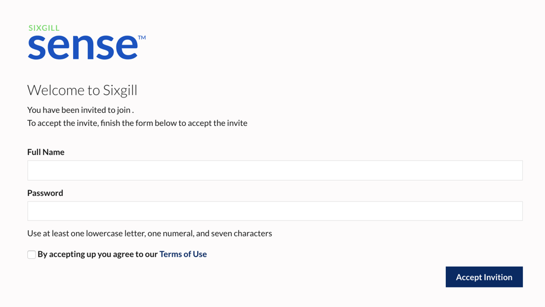
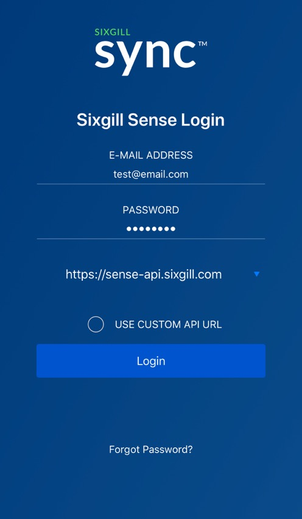
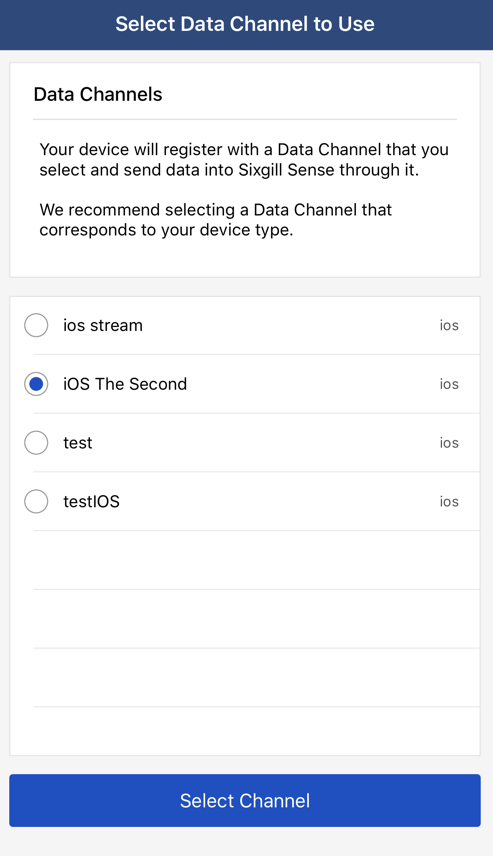
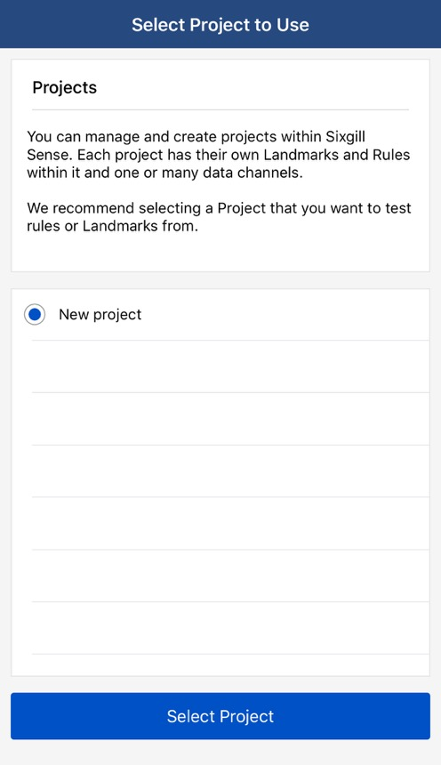
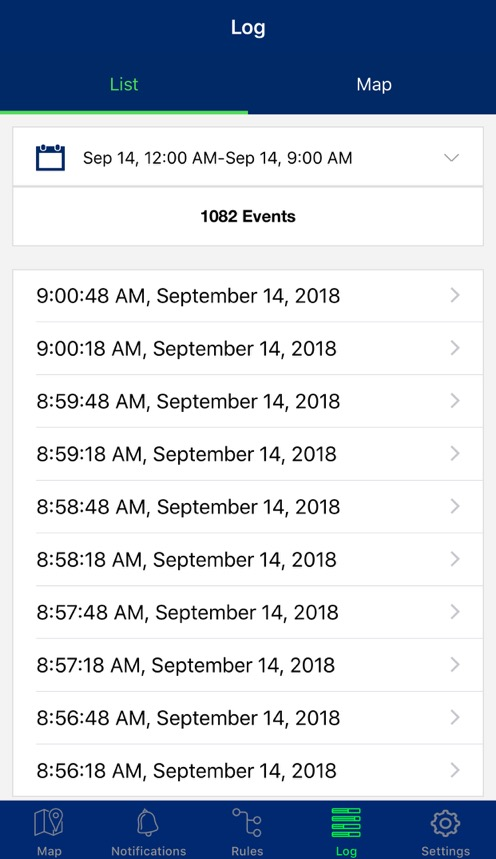

## Creating an Account
You will need an account to get started with Sixgill Sense. You can sign up one of two ways: you will either create your organization OR you will be invited to an existing one. If you are creating own organization, follow these steps. If you are joining an organization created by someone else, skip to [Joining an Existing Organization](#joining-an-existing-organization)

1.  Go to [sense-dashboard.sixgill.com](http://sense-dashboard.sixgill.com) and sign up for an account. You will be required to validate your email address.
    
2.  Once you are signed in, you can add other users to your organization through the Admin tab.

### Joining an Existing Organization

Once you have been invited to join an existing organization, you will receive an email invitation titled "Welcome to Sixgill Sense".

1. In the email, click "Accept Invite".
2. Enter your full name and desired password. Read and accept the terms of service.
3. Click "Accept Inviation" to sign in to the organization's dashboard.

## Channels
A data Channel is a source of data that flows into the Sense platform. For example, a Channel could include all iOS devices with an app that uses the Sense Reach iOS SDK. Channels are collections of mobile apps that use the Sense SDKs, or of any other devices that write to the Sense Ingress API. See [Channels Overview](/guides/channels/overview) for more information on creating and using channels.

## API Authentication

### Authenticating Devices
To send sensor data to the platform using the Ingress API or the mobile SDKs, you will need to authenticate using an API key for the respective channel - eg, iOS devices use an iOS channel, IoT devices use an IoT channel, etc. You can get these keys from the **Channels** section on the dashboard.

1. In the dashboard, go to Channels
2. Click the appropriate channel on the left, or [create a new channel](/guides/channels/overview).
3. Copy an existing key from **Api Keys** section, or click **Generate New ApiKey** to create another for that channel.

### Sense API Authentication

The Sense API authenticates requests with a user-specific JSON web token through Bearer authentication.

To get this token, the user makes a POST /v2/login request with their email and password combination. These are the same credentials used to log into your account on the dashboard.

## Configuring a Channel for Push
In order to receive Push notifications, the Channel will need to be configured with mobile keys depending on the app you are using to stream data. For iOS, you will need to upload the Push certificate for your app as a **.p12 file**. For Android, you will need the Firebase key or Google Cloud Messaging key used by the app.

1. Go to Channels
2. Select the mobile channel you wish to add mobile keys for.
3. Click **Manage Mobile Keys** at the top right corner  

### Apple Push ###
- If this is an iOS channel, select the type of Environment this certificate is configured for - **Development** or **Production**. This needs to match the certificate type for Push to work so double-check that you have selected the correct option.
- Click "Choose File" and select the .p12 file from your system.
- Click **Save**  
The certificate type should be listed on the left.

### Android Push ###
- If this is an Android channel, select the messaging type you will be using - **Google Cloud Messaging** or **Firebase Cloud Messaging**. This needs to match the messaging type used by the app, so double-check that you have selected the correct option.
- Enter the API key
- Click **Save**  
The selected messaging type should be listed on the left.

_Note: If you are using the Sync 2.0 demo app and would like to test the Send Push action, please contact support@sixgill.com to configure your Channel with the proper push certificate_  

## Connecting Devices
Device sensor data is ingested into Sense through the [Ingress API](/apis/ingress). For Android and iOS devices, this can be done by integrating the Reach SDK into a mobile app. The SDK handles sensor gathering at configurable intervals, and automatically sends the data to the Ingress API. The Sixgill Sync 2.0 demo app uses the Reach SDK as well as the Sense API to showcase the sensor ingestion capabilities of the platform. **The SDKs are authenticated using the [API keys](##api-keys) for their respective channels.**

### iOS SDK

[Sixgill Reach iOS SDK and User Guide](/guides/devices/ios-sdk)
*updated October 28th, 2018*

### Android SDK

[Sixgill Reach Android SDK and User Guide](/guides/devices/android-sdk)
*updated October 28th, 2018*
  
### Sixgill Sync 2.0
Users can also demo the mobile SDK capabilities by using the Sixgill Sync 2.0 demo application, available on the App Store and (coming soon) the Google Play Store.

[Sixgill Sync 2.0 for iOS](https://itunes.apple.com/us/app/sixgill-sync-2-0/id1272269863?mt=8)

[Sixgill Sync 2.0 for Android](https://play.google.com/store/apps/details?id=sync.sixgill.com.sync)

_Updated Sync 2.0 apps for both platforms to be released November 2018_

Pre-reqs:
A dashboard account. See [Creating an Account](#creating-an-account) for details
A [Channel](#channels) for your device type.

1. Download and open the app on your device.
2. Accept the Terms of Service.
3. Allow the requested permissions for the sensor you woud like to enable. For example, to use the location sensors and gather location data, you will need to enable Location Services.

4. Login with your Sense account credentials. _These are the same credentials used to log into your account on the dashboard._ 

5. Select the channel and corresponding project you wish to connect to. If your project isn't listed, make sure you've selected the correct channel. The channel is configured to work with a select group of projects.

6. Your device will now connect to your selected channel. The app will begin collecting sensor data events for ingestion by the Sense platform.

You will know that Sync is connected by checking your Log tab. This will begin to populate with events being emitted from the device to the Sense platform.
  

### IoT Devices

The platform is able to ingest generic IoT sensor data. Developers will need to use the [Ingress API](/apis/ingress) to send data to the IoT events endpoint.

1. [Schemas](/guides/channels/schemas) are required in order to make the most of your sensor data. Contact [support@sixgill.com](mailto:support@sixgill.com) with any questions regarding setting up your channel for IoT data.
2. Create an **IoT Devices** Channel if you do not have one already and select the Schema you created.
3. Use the Channel API keys to register your IoT device. Use the JSON Web Token in the response to authenticate your future requests.
4. You can begin sending sensor data to the IoT events endpoint using a gateway or other agent.  

See the IoT Events section of the [Ingress API](/apis/ingress#/Mobile/post_v1_iot_events) docs for more information.
  
#### Schemas

Device data needs to be mapped to fields so you can trigger rules and view analytics. This is done using [Schemas](/guides/channels/schemas). Mobile devices (iOS, Android) have predefined schemas that you can use with our SDK that don't require configuration.

For IoT devices you need to first create a custom schema. You can send any kind of data with IoT devices. It is recommended that you generate IoT schema based on your event payload. Once your schema is defined you can use it in a Channel and see data being ingested. You can update a schema if necessary at a later time.

## Rules
Rules are at the heart of device interactivity within the Sense platform. Rules define conditions around devices and sensor data and specify the actions to trigger when the conditions are met. For example, devices entering a geofence or coming within range of a beacon could trigger a notification to another device, send an email to a recipient, or post data to another web service. Rules can be complex and perform multiple actions or include data from multiple channels.

See the [Rules overview](/guides/rules/overview) for more information on creating rules.

## Landmarks
Landmarks are geographical points of interest (POIs) defined by a perimeter. Landmarks can be used as conditions to rules that evaluate a device's proximity to an area. A rule may check if a device has entered, exited, is inside, or outside the landmark. The Landmark API provides several options for defining landmarks.

See the [Landmarks overview](/guides/landmarks/overview) for more information on adding landmarks.
