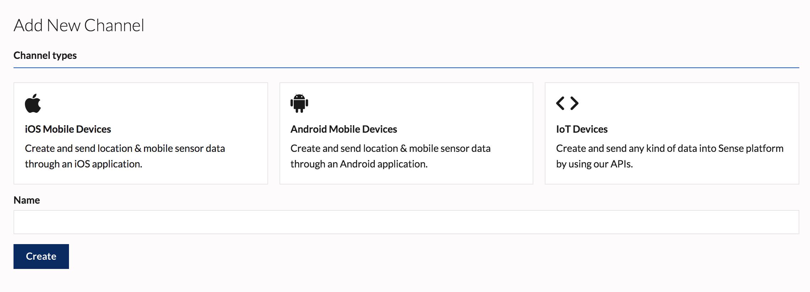

A data Channel is a source of data that flows into the Sense platform. For example, a Channel could include all iOS devices with an app that uses the Sense Reach iOS SDK. Channels are collections of mobile apps that use the Sense SDKs, or of any other devices that write to the Sense Ingress API.

## Philosophy

##IOT

## Ingress

| <h3>Native Feel</h3> | <h3>Forward Thinking</h3> | <h3>Extendable</h3>  |
| --- | --- | --- |
| Do you know HTML and CSS? Check out our docs and you're off to the races! No special rules or styling paradigms to master. | Something is designed to take advantage of all that email can do while still providing a solid experience for all clients. | You can create your own powerful elements and style rules. Share them with the world, or keep 'em to yourself. Your choice. |

