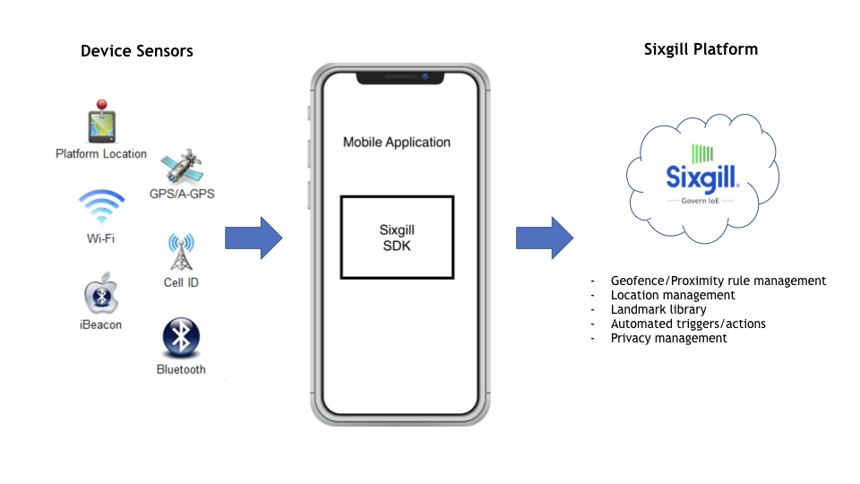

##Introduction

Reach is the Sixgill mobile SDK for edge processing and data collection with support for Android and iOS. It enables Sixgill partners to deliver the business value of taking action based on being near a person, place, or thing. Apps transmit sensor data and leverage server-resident definitions of landmarks, rules, and actions.  Reach acquires data from available sensors, performs actions on that data given a set of rules, and syncs the data to the Sixgill Sense cloud.  Platform differences in security, normalization, data integrity, networking, background availability, user permissions, and others are handled for you by the Reach SDK enabling quick and easy access to the rich sensor data coming from today’s devices.

**LANDMARKS** are project-specific points of interest that define proximity. They can be composed of virtual boundaries (geofences), Wi-Fi access points, or beacons. **RULES** define conditions around mobile devices, landmarks, and sensor data and can trigger actions when the condition is met. For example, the condition might be proximity to a person, place, or thing as indicated by entering a geofence or coming within range of a beacon. Example **ACTIONS** are messages delivered to the mobile device, sending an email to a recipient, or posting data to a web service in order to trigger existing business logic. 

##Capabilities
The Sixgill Reach SDK allows mobile developers to easily integrate the capabilities of the Sixgill platform into their application via a lightweight module with APIs. These capabilities include:

###Data Collection
Collect and send sensor data to Sixgill Sense on a configurable time-based cadence.  During the collection window, Reach will query all of a device’s sensors for individual readings. This data is normalized and aggregated into a single collection that can be passed to the Sense platform. Data is synced whenever connectivity is available, and the SDK operates efficiently in the background to save on data limits and battery. Data collection can be dynamically configured from the cloud based on the application needs and device context.

####Mobile Sensor data collected:
Beacons
GPS
Wifi
Cellular Signal
Battery Level
Accelerometer (for activity state such as walking / running)

###Push Notifications
The Sixgill Reach service provides mobile application developers a way to trigger push notifications to a mobile application based on device and sensor information. Messages can be plain text or formatted content. Message Event Notification can occur via the mobile platform push mechanism (i.e. Apple APNS, Google GCM) or through the use of device-side polling.

###Edge Processing
Reach can dynamically process sensor data using an edge version of the Sixgill Rules Engine.  Utilization of our edge processing can improve latency, data usage, battery, and even privacy since data can be processed without leaving the device.   

###Device Identity Registration
The Reach SDK is initialized with an Sixgill Sense API Key available on the Sixgill Dashboard.  Devices provide the API Key to the Sixgill Sense cloud and receive an authentication token back which is used in all subsequent requests.  Once registered, Identity metadata such as phone number, email, or other key value data can be associated with a device throughout the sixgill platform. 

###Configuration
The functionality of the SDK can be changed dynamically based on a device’s configuration.  The SDK can be turned off or on, made to run slower or faster, or specific sensors can be whitelisted or blacklisted.  In conjunction with the Sixgill Rules Engine, the SDK’s functionality can change in certain areas or after specific sensor readings. 
