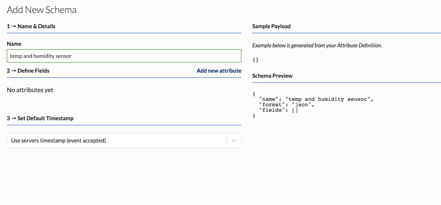
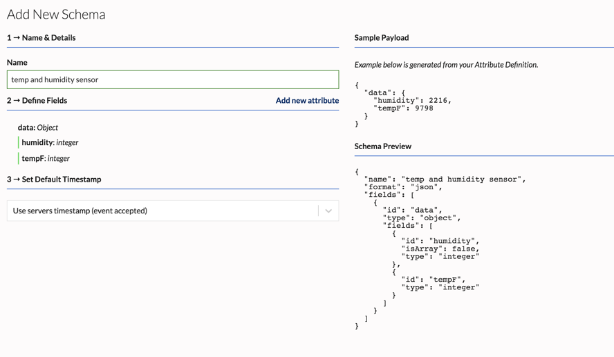

In order to provide the most optimal rule evaluation and analytics features, the data coming through the channel need to be mapped to specific data types. This mapping is done using schemas assigned to each channel. A schema defines what the fields in your sensor data payloads represent. For example, you may want to define that a specific field is an integer so that you can trigger a rule when that value reaches above or below a certain threshold. Mobile devices (iOS, Android) that connect using the Reach SDKs will use predefined schemas which are automatically assigned to the iOS and Android channels. No additional configuration is needed for mobile devices that connect using the SDK.

To connect IoT devices, you will first need to define a custom schema. You can send any kind of data with IoT devices, but it is recommended that you generate the schema based on the event payload being sent by the device. Once your schema is defined you can assign it to your IoT channel which will allow the data to be ingested. You can update a schema if necessary at a later time.

## Creating a Schema

To create a schema through the dashboard
1. Go to **Channels**
2. In the left sidebar under Schemas, click **+ Add Schema**



3. **Name & Details** - Enter a name for the schema in "Name" field
4. **Define Fields** - Use this section to specify the format of your schema


Here is a simple example:
To define a schema for a JSON payload such as
```json
 "data":{
      "tempF":52,
      "humidity":23
    }
```
add each attribute individually under the **Define Fields** section.

- Click **Add new attribute**  
- In the **Attribute Location** drop-down, ensure that "root" is selected
- In the **Attribute Identifier** field, enter "data"
- In the **Data Type** drop-down, select "Object"
- Click **Create Attribute** 
Next, add the second attribute named "tempF" the same way:  
- Click **Add new attribute**
- In the **Attribute Location** drop-down, select "data"
- In the **Attribute Identifier** field, enter "tempF"
- In the **Data Type** drop-down, select "Integer"
- Click **Create Attribute**

Add the final attribute named "humidity" in a similar manner. 

5. When finished, click **Create Schema**  Your schema should look like the following:



Schemas can also be created using the API.

## Assigning a Schema

Once you are satisfied with your schema, you can assign it to an IoT channel which you can then use to connect your devices.

1. Go to Channels
2. In the left sidebar, click **+ Add Channel**
3. Select IoT Devices
4. Enter a name for your channel, then select your **Schema** in the drop-down
5. Click Create

Your schema is now assigned to this channel. *Note: at this time that you cannot change a schema that a channel is assigned to. You will need to create a new channel.*
