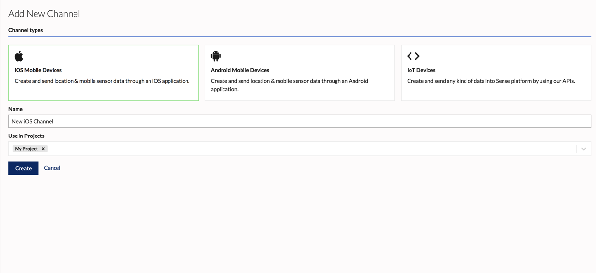

A data channel is a source of data that is connected to the Sense platform. For example, a channel could include iOS devices running a Reach-enabled app. Channels are collections of mobile devices enabled with the Reach SDK, or other devices that connect to the Sense Ingress API or Reach Edge agent (gateway).

Channels are created based on the type of device that will connect to it. A channel can be of type iOS, Android, or IoT. Each channel uses its own API key for authentication.

## Creating a Channel

1.  In the dashboard, go to Channels. If this is your organization's first channel, you will be presented with an Intro screen. Click **Add New Channel**

2.  Click on the type of channel you would like to create
    -  Select **iOS Mobile Devices** to create a channel for iOS data for apps using the Sense Reach iOS SDK
    -  Select **Android Mobile Devices** to create a channel for Android data for apps using the Sense Reach Android SDK
    -  Select **IoT Devices** to create a channel for generic IoT data that will be sent using the Sense Ingress API
3.  Enter a name for your channel. Channel names must be unique to your account.
4. 	Enter the name of one or more projects to assign your channel to. Rules created under these projects will be able to use this channel as a data source.

This will create a Channel for the type of data you wish to ingest.

## Editing a Channel

1. In the dashboard, go to Channels. Select the channel you would like to edit.
2. In the top right, click **Edit Channel**
3. Edit the name or projects the channel is assigned to. You also have the option to delete the channel. _Note: Deleting a channel will impact the devices connected to it._
4. Click **Update** when you have completed your changes.

## Channels API

See the [Channels API docs](/apis/sense-api#tag/channels) for creating and managing channels through the API.

