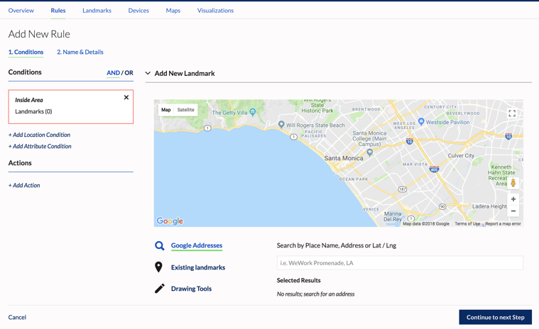

Rules are at the heart of device interactivity within the Sense platform. Rules define conditions around devices and sensor data and specify the actions to trigger when the conditions are met. For example, devices entering a geofence or coming within range of a beacon could trigger a notification to another device, send an email to a recipient, or post data to another web service. Rules can be complex and perform multiple actions or include data from multiple channels.

## Creating a Rule

1. In the dashboard, go to Projects > Rules
2. Click **Add New Rule**
3. Enter the condition(s) for the rule. You can choose from a *Landmark Condition* or *Attribute Condition*

### Adding a Landmark Condition  

Landmark - A landmark is a geofence around a certain location. It can be a circle, polygon, or rectable.

**When will the event happen?**   
First select WHEN the event will trigger in relation to the landmark.  
a) Inside Area - Trigger when device is inside this landmark
b) Exit Area - Trigger when the device was previously inside this landmark, and then leaves it   
c) Enter Area - Trigger when the device was previously outside this landmark, and then enters it    
d) Outside Area - Trigger when the device is outside this landmark  

**Which location do you want the event to trigger from?**  
Next, select the landmark for this condition
- To use an existing landmark from the project, click **Select From Project Landmarks**. This will display a list of available landmarks, if any. Clicking on the name will display the landmark in the map. You can use the **Search By Landmark Name** search box to filter the list.
- To create a new landmark, click **Add New Landmark**  

a) Move the map or use Google Addresses to center the map as needed, or select from Existing Landmarks  
b) Use the Drawing Tools to create a geofence around your desired area  
c) Click **Use Geofence**  
d) Enter a name for the landmark  
e) Click **Create Landmark** to save  

For testing purposes, we recommend adding a landmark around your current geographical area.  

Landmarks for the project can also be created separately in the **Landmarks** section. You can then select these landmarks when creating a rule under **Select From Project Landmarks**.

### Adding an Attribute Condition
Attribute - a custom condition or freeform condition which allows you to specify attributes/properties and the logical condition(s) to be evaluated. These conditions can be simple using pre-defined attributes (Manufacturer, Device Type) or written to be more complex using the Advanced editor. The attributes being compared in the conditions will need to exist in the data stream for the device.

4. When adding conditions, be sure to select whether these are **AND or OR** conditions.  
**AND** is selected by default, meaning the device will need to satisfy all conditions to trigger the rule. For example, a device needs to be inside a landmark AND also be an iOS device to trigger the rule.  
**OR** can be used if the device only needs to satisfy one condition to trigger the rule. For example, a device needs to either be inside a landmark OR be an iOS device to trigger the rule.
 
### Adding an Action
An action is the behavior that is executed when the conditions are met. An action can be in the form of sending an SMS, a Push message, an email, a webhook, or a combination of actions.  
a) Click *New Action* under the Actions section
b) Select your desired action by clicking on the action: SMS, Email, Send Push, Webhook   

#### SMS  
- **Message** - Enter the SMS message to be sent to recipients   
- **Phone Numbers** - Enter the recipient phone numbers, numerals only. Hit "Enter" after each number.

#### Email  
- **Subject** - Enter the subject line of the email   
- **Message** - Enter the desired message body  
- **Recipients** - Enter the recipient email addresses. Hit "Enter" after each address.   

#### Send Push  
- **Subject** - Enter the subject line of the message  
- **Message** - Enter the desired message body  
- **Recipients** - Check the **Triggering Device** box (most commonly used). You could also specify a list of device IDs. Hit "Enter" after each device ID.   

#### Webhook  
- **URL** - Enter the URL to send the webhook action to.  
- **Method** - Select the HTTP Request method to use for the action.  
- **Body** - (optional) Enter a request payload for the action.  
- **HTTP Username, HTTP Password, Header, Value** - (optional) Fill in the remaining fields as needed   

Add additional actions if needed.

### Adding Rule Details
1. Click "Continue to next Step"
2. **Name** - Enter a name for this rule.
3. **Description** - (optional) Enter a description for the rule
4. **Minimum Time Between Triggering (in Seconds)** - (optional) The minimum amount of time that must elapse before the rule can be triggered again
5. **Tags** - (optional) Enter tags for this rule   

#### Schedule
Optionally, use the Schedule section to set a schedule for when the rule is active and runnning. This will limit the days of the week or times of the day when the rule is active. **By default, the rule will be enabled within 5 minutes of activation and will continue to run until it is turned off or deleted.**

- **Timezone** - Select the timezone for this rule's schedule.  
- **Set timeframe (start / end)** - Check this box to set the start/end date for the rule.  
- **Only run on specific Day(s) of the week** - Check this box to set a weekly schedule for the rule.  
- **Only run on specific Hours of the Day** - Check this box to set a daily schedule for the rule. For example, you may only want the rule to run between 9:00am and 12:00pm.

### Activating the Rule
1. After you have entered the rule conditions, actions, name, and other details, click "Continue to next Step"
2. You will be prompted to simply "Save" the rule but not activate it, or to "Save & Activate" which will enable the rule right away. _Note: Rule will be enabled within 5 minutes of activation._
3. You can activate or de-activate any rules in your selected project by going to the **Rules** list and using the toggle under the Actions column to enable/disable your selected rule.
4. You can edit an existing rule by going to the **Rules** list and clicking the Edit icon under the Actions column to modify your selected rule.

_Note: Any modifications to rule actions or a rule's enabled/disabled state will take effect within 5 minutes._
