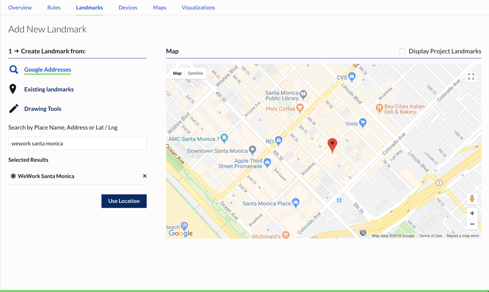
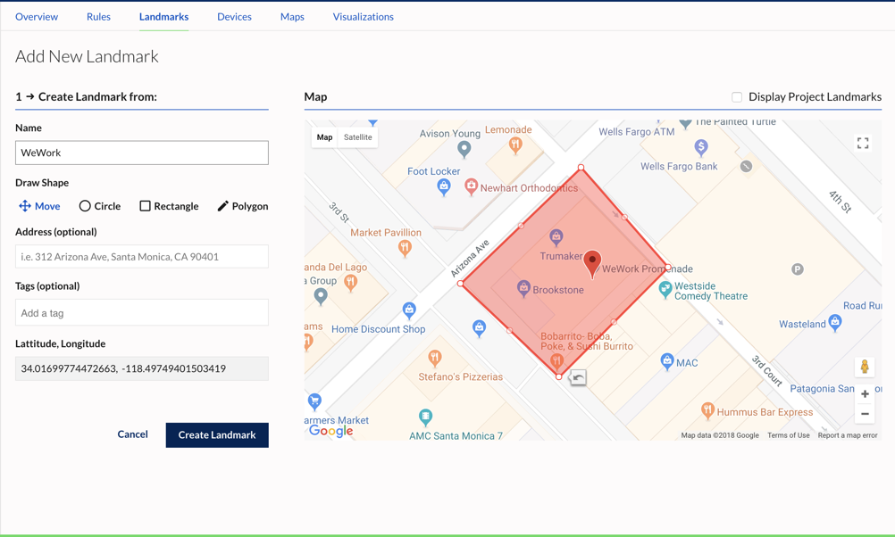
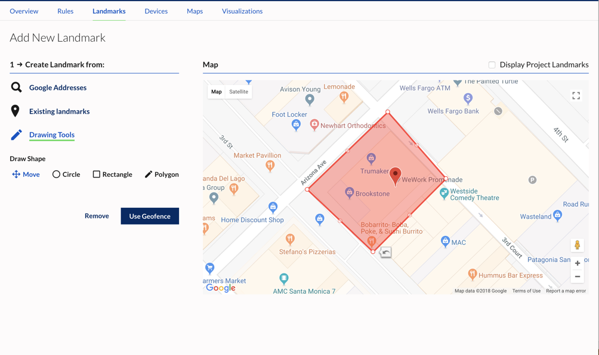

Landmarks are geographical points of interest (POIs) defined by a perimeter. Landmarks can be used as conditions to rules that evaluate a device's proximity to an area. A rule may check if a device has entered, exited, is inside, or outside the landmark. The Landmark API provides several options for defining landmarks.

Landmarks can be added within the **Add New Rule** or through the Landmarks section.

1. In the dashboard, go to Projects > Landmarks
2. Click **Add New Landmark**

3. Move the map or use Google Addresses to center the map as needed, or select from Existing Landmarks  
4. Use the Drawing Tools to create a geofence around your desired area  
5. Click **Use Geofence**  

6. Enter a name for the landmark  
7. Click **Create Landmark** to save

The landmark will now be available in the **Select From Project Landmarks** dropdown when creating a rule.

See the [Landmarks API Guide](/guides/landmarks/api-guide) for information on creating rules through the Sense API.