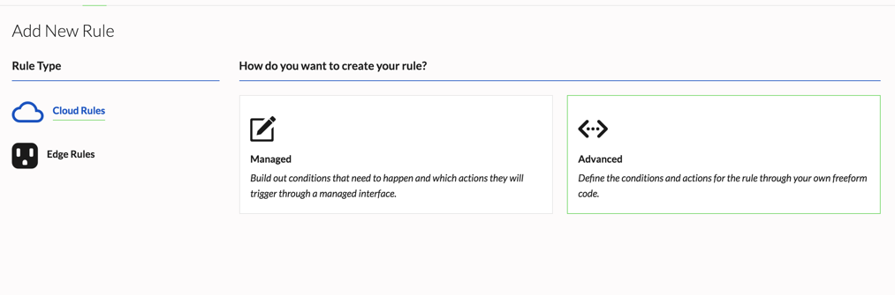

## Advanced Rule Creation

Use Advanced Rules to compose the free-form expression you will need to evaluate for your rule.

1. In the dashboard, go to Projects > Rules
2. Click **Add New Rule**. Select whether you are creating **Cloud Rules** or **Edge Rules**. 
- Cloud Rules process sensor data ingested on the cloud-level. 
- Edge Rules are downloaded to the device and can process incoming sensor data and trigger actions without having to send the data to the cloud or external system.

3. Select **Advanced** and click "Continue"



2. In the **Conditions** text area, a sample condition is already populated: 
```
event.attribute.number > 1
```

Replace this with the free-form expression to be evaluated as the conditions for your rule. Certain Javascript functions can be included. In this example, the event is from channelId "01CSEX91A9R0BN400NFZ34GQHZ" and event.payload.location needs to be inside landmark 01CSVQGJQ51QENCJ2X02VQASXW

```
event.channelId == "01CSEX91A9R0BN400NFZ34GQHZ" && landmark("inside", ["01CSVQGJQ51QENCJ2X02VQASXW"], event.payload.location)
```
## Supported Functions

Advanced rules support Javascript functions, including:

- landmark(trigger, landmarkIds, event.payload.location) - returns true if event.payload.location match trigger and landmark boundaries
- match(event.payload.attribute, string, flags) - returns true if attribute matches string
- toDate(isostring) - convert isostring to date
- now(timezone) - return the current date in given timezone
- minutesOfDay(timezone) - returns minutes of the day in given timezone
- dayOfWeek(timezone) - returns day of the week (sunday-saturday : 0 - 6) in given timezone