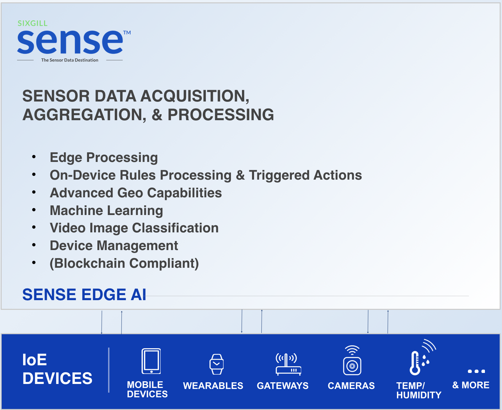

## Introduction
Edge processing allows data and operations to be processed directly on a governed device without the need for a persistent connection to the platform. This improves latency and allows automated responses to be generated and received
while they are still relevant. It can also significantly cut down on data that has to be processed and
sent to storage in a cloud connected system and can provide system functionality in low
connectivity environments.

Sixgill’s Sense Edge processing is configurable so that individual rules can be triggered on-device
or in the cloud. Customers can also determine an automated schedule for devices to report back
to the platform or can be configured to be completely network gapped. All components are
designed to utilize multiple CPU cores so a single process binary can fully utilize a target device’s
hardware if desired.

Sense Edge AI extends the power of the Sense platform for end-to-end, edge-to-cloud sensor data services.

- Connect edge devices to the cloud 
- Manage the exchange of data with the Sense platform
- Maximize data security and control with encryption, processing and analysis on the edge  
- Use machine learning models at the edge for faster real-time prediction
- Enhance operational reliability
- Scale to any volume efficiently and cost effectively  
- Deploy on-premise, cloud-managed, or hybrid
- Implement across use-cases such as: asset orchestration, movement monitoring/response, predictive maintenance, anomaly detection, machine vision/image classification, and more